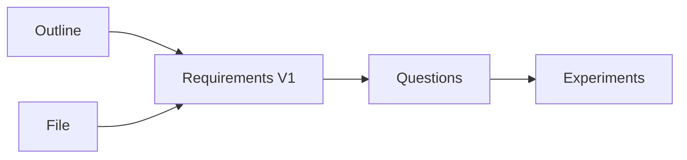

# Report

## Viewing data

Viewed data. Like Fast5. No timestamps or labels, stored as tensor of ints.

## Exploring the problem

### Challenges
- Trade off fast vs accurate: can downsample behind the scenes quickly but does that effect the interpretation of scientists

Think about:
- Architecture
- Hosting
- Risks
- How to build

### Result
Requirements specification version 1.

First thoughts:
-  ROIs/bookmarking system useful to create references in the large dataset 
(note: jumping between ROIs might be hard to do in real-time), i.e. we must give users not only the map but
allow them to add landmarks.
- What is more expensive: compute or storage?

